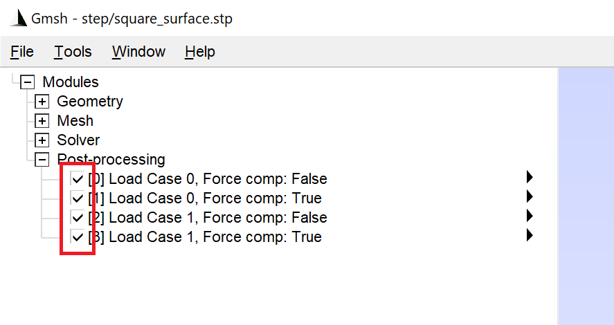

# Engineering with Computers (2025)

This repository contains the code and examples for the publication
```
M. Jäger, S. Wartzack, 
Nodal force distribution of moments on arbitrarily shaped geometries without multi-point constraints, 
Engineering with Computers (2025), DOI: 10.1007/s00366-025-02118-y 
```

## Requirements

- [python](https://www.python.org/)
- [numpy](https://numpy.org/) `pip install numpy`
- [gmsh](https://gmsh.info/) `pip install gmsh`

## Usage

### Run Examples
Run any of the example files, and once finished, the `gmsh` UI will open.\
Result views for all load cases, with and without force compensation, will be generated and displayed.

### Changing Models
You can copy any example file and modify the loaded model. 
You can specify the element size and mesh order to be used. 
For example:
```python
import_and_mesh('step/cylindrical_surface.stp', element_size=0.5, mesh_order=1)
```

### Changing Loads
Loads are specified using the `DimTag` notation of `gmsh`, along with a 3x1 vector for each load. 
For example:
```python
load_case_dimTags: List[List[Tuple[int, int]]] = [[(2, 1), (2, 2)],
                                                  [(2, 1)]]

load_cases: List[np.ndarray] = [np.array([[2000, 0, 3000], 
                                          [1000, 0, 1000]]),
                                np.array([[3000, 700, -1000], ])]
```
- `load_case_dimTags`
  - A list of load cases, where each element contains a list of tuples specifying the surface in `gmsh` to which the load is applied.
  - `(2, 1)` means the 2nd dimension (surface), face no. 1.
  - To determine the face number in `gmsh` 
    - Run `gmsh.fltk.run()`, 
    - Load the STEP file via `File -> Open`
    - Go to `Tools -> Options -> Geometry`
    - Activate `Surface labels`
- load_cases
  - A list of load cases, where each element contains a NumPy array with shape `(N_LOADS, 3)` representing the loads in Nm.
  - For each load case, `N_LOADS` must match the length of the list of surface `DimTags`.


### Hide Result Views
To hide some results, simply uncheck the views you want to hide under `Modules -> Post-processing`.\



## Structure

- [src](src)
  - [`common.py`](src%2Fcommon.py) - Methods for importing STEP files and plotting.
  - [`moment2force.py`](src%2Fmoment2force.py) - The method published in the paper.
- [examples](examples)
  - [settings](examples%2Fsettings)
    - [`colormap_orange.opt`](examples%2Fsettings%2Fcolormap_orange.opt) - Configuration file for visualization.
  - [step](examples%2Fstep) - Contains the 3D data of the surfaces and the truss node.
    - [`square_surface.stp`](examples%2Fstep%2Fsquare_surface.stp)
    - [`cylindrical_surface.stp`](examples%2Fstep%2Fcylindrical_surface.stp)
    - [`arbitrary_surface.stp`](examples%2Fstep%2Farbitrary_surface.stp)
    - [`truss_node.stp`](examples%2Fstep%2Ftruss_node.stp)
  - [`square_surface.py`](examples%2Fsquare_surface.py) - Example 3.1 and 3.2
  - [`cylindrical_surface.py`](examples%2Fcylindrical_surface.py) - Example 3.3 and 3.4
  - [`arbitrary_surface.py`](examples%2Farbitrary_surface.py) - Example 3.5
  - [`truss_node.py`](examples%2Ftruss_node.py) - Example 4